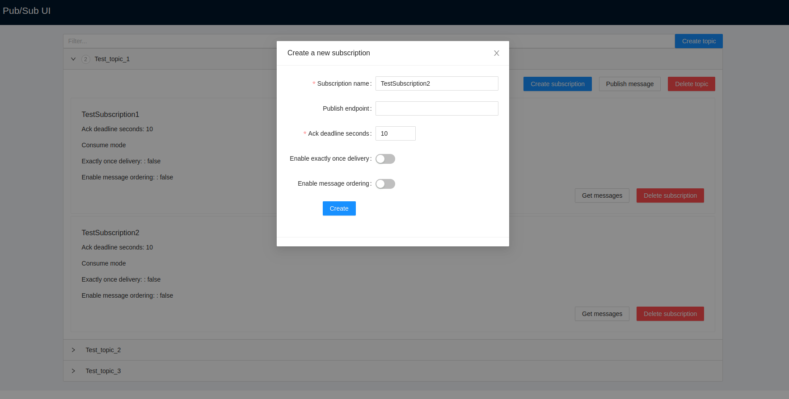

# Introduction
PubSubUi - is a simple web interface for [Google Cloud Pub/Sub emulator](https://cloud.google.com/pubsub/docs/emulator)



# Usage

```yaml
version: "2"

services:
  pubsub:
    image: singularities/pubsub-emulator
    environment:
      - PUBSUB_PROJECT_ID=project-test
      - PUBSUB_LISTEN_ADDRESS=0.0.0.0:8432
    ports:
      - "8432:8432"

  pubsub-ui:
    image: ivanoviii/pub-sub-ui:latest
    environment:
      - PUBSUB_PROJECT_ID=test
      - PUBSUB_EMULATOR_HOST=pubsub:8432
    ports:
      - "8997:8780"

```
